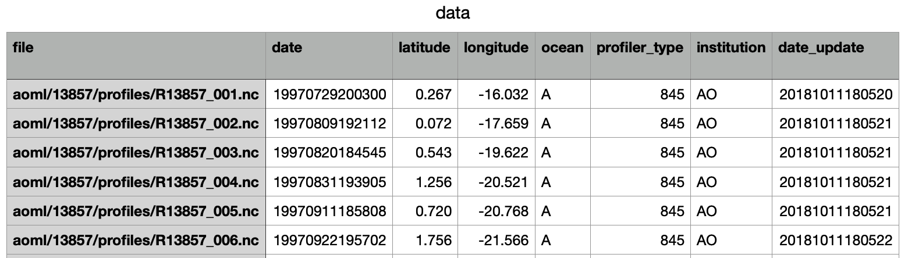

# ARGO-Floats-Visualization
A Python project that can automatically check ARGO floats update situations. Outputs a sites-update-histogram and two folium maps which show daily update floats' locations. 

This repo may not be able to download the exact ARGO floats file as it is too large. The program will convert the index file into pandas Dataframe and csv format, you can modify them later to do more jobs.

The file can be download directly in this [link](https://data-argo.ifremer.fr/ar_index_global_prof.txt) (or you can download it using the Python script in this repo). After running the program, the data format (in pandas.Dataframe) looks like this:

## How to use it?

1. clone this repo using `git clone https://github.com/HaoyuCui/ARGO-Floats-Visualization.git`
2. go to this repo use the command `cd ARGO-Floats-Visualization`, and switch to your virtual environment, run `pip install -r requirements.txt` to download and install the dependency modules
3. you can simply run the command `python3 Argonbsp.py` or you can add some arguments like:
   1. `--url` choose where to download ARGO-Floats file, you can choose another mirror site
   2. `--file_path` choose where to put the download file (about 200MB, the download process may take a while)
   3. `--force` the program will check if the file is the local file is the newest, you can also force to download it
4. Finally, there will be two html files and an image generated in the root
